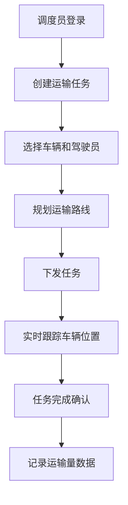
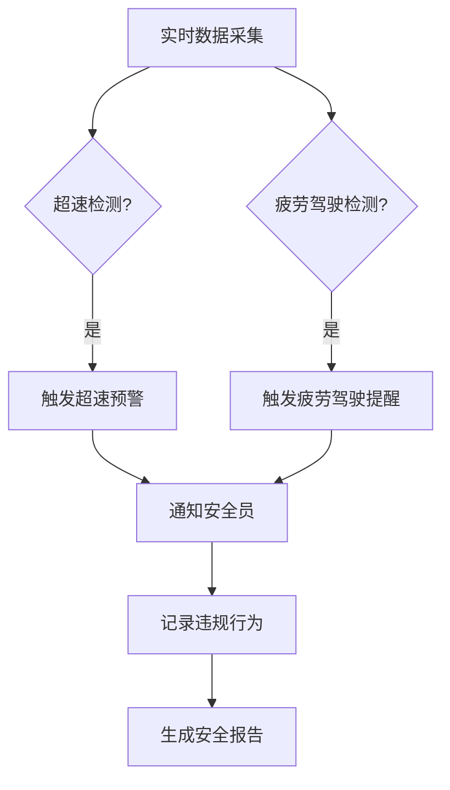

## 1. 产品概述

工地运渣车管理系统是一款面向建筑工地的智能化车辆管理平台，实现对运渣车辆全生命周期的数字化管理。系统通过整合车辆信息、运输调度、驾驶员管理、运输统计、安全监控等核心功能，提升工地运输效率，保障作业安全，满足行业监管要求。

- 核心目标：实现运渣车辆数字化、智能化管理，提升运输效率，降低安全风险
- 目标用户：工地管理人员、调度员、安全员、车队管理员、系统管理员
- 市场价值：解决传统工地车辆管理混乱、调度低效、安全隐患多等痛点

## 2. 核心功能

### 2.1 用户角色

| 角色 | 登录方式 | 核心权限 |
|------|----------|----------|
| 系统管理员 | 账号密码登录 | 全系统权限管理、用户配置、数据备份恢复 |
| 工地管理员 | 账号密码登录 | 车辆/驾驶员管理、任务调度、数据统计查看 |
| 调度员 | 账号密码登录 | 运输任务分配、路线规划、实时跟踪 |
| 安全员 | 账号密码登录 | 安全监控、违规记录、预警处理 |
| 车队管理员 | 账号密码登录 | 车辆维护、证件管理、驾驶员信息管理 |

### 2.2 功能模块

1. **首页仪表盘**：数据概览、关键指标、快捷操作入口
2. **车辆信息管理**：车辆基本信息、证件有效期管理、维护记录
3. **运输任务调度**：任务分配、路线规划、实时跟踪
4. **驾驶员管理**：驾驶员信息、资质管理、出勤记录
5. **运输量统计**：每日/每月/每车运输量数据、可视化报表
6. **安全监控**：超速预警、疲劳驾驶提醒、违规行为记录
7. **系统管理**：用户权限配置、数据备份与恢复

### 2.3 页面详情

| 页面名称 | 模块名称 | 功能描述 |
|----------|----------|----------|
| 登录页 | 用户认证 | 账号密码登录、记住密码、忘记密码 |
| 首页仪表盘 | 数据概览 | 在途车辆数、今日运输量、安全预警数、待处理任务统计卡片 |
| 首页仪表盘 | 快捷入口 | 各功能模块快捷导航按钮 |
| 首页仪表盘 | 实时动态 | 最近运输任务、安全预警列表 |
| 车辆管理页 | 车辆列表 | 车辆信息表格、搜索筛选、分页 |
| 车辆管理页 | 车辆详情 | 车辆基本信息、证件信息、维护记录标签页 |
| 车辆管理页 | 新增/编辑车辆 | 表单录入车辆信息、证件有效期、上传证件照片 |
| 任务调度页 | 任务列表 | 运输任务列表、状态筛选、任务详情 |
| 任务调度页 | 任务分配 | 选择车辆和驾驶员、指定路线、设置时间 |
| 任务调度页 | 实时地图 | 车辆位置跟踪、运输路线可视化 |
| 驾驶员管理页 | 驾驶员列表 | 驾驶员信息表格、资质筛选 |
| 驾驶员管理页 | 驾驶员详情 | 基本信息、资质证书、出勤记录、违章记录 |
| 运输统计页 | 数据概览 | 运输量趋势图、车辆排行、任务完成率 |
| 运输统计页 | 明细报表 | 每日/每月/每车运输量明细、数据导出 |
| 安全监控页 | 实时监控 | 车辆速度监控、驾驶时长监控 |
| 安全监控页 | 预警列表 | 超速预警、疲劳驾驶提醒、违规记录 |
| 系统管理页 | 用户管理 | 用户列表、角色分配、权限配置 |
| 系统管理页 | 数据管理 | 数据备份、数据恢复、操作日志 |

## 3. 核心流程

### 3.1 运输任务调度流程

调度员登录系统后，创建新的运输任务，选择可用车辆和驾驶员，规划运输路线，设置任务时间。任务下发后，系统实时跟踪车辆位置和状态，任务完成后自动记录运输量数据。

### 3.2 安全监控预警流程

系统实时监控车辆行驶速度和驾驶员驾驶时长，当检测到超速或疲劳驾驶时，自动触发预警，通知安全员处理，并记录违规行为。

## 4. 用户界面设计

### 4.1 设计风格

- **主色调**：工业蓝色系 (#165DFF)，代表专业、可靠、科技感
- **辅助色**：警示橙 (#FF7D00)、安全绿 (#00B42A)、危险红 (#F53F3F)
- **中性色**：深灰 (#1D2129)、中灰 (#4E5969)、浅灰 (#C9CDD4)、背景灰 (#F2F3F5)
- **按钮风格**：圆角矩形按钮，悬停时有轻微阴影和颜色变化
- **字体**：系统默认无衬线字体，标题加粗，正文常规
- **布局风格**：左侧导航栏 + 顶部工具栏 + 主内容区的经典后台布局
- **卡片风格**：浅色背景卡片，圆角 8px，轻微阴影

### 4.2 页面设计概览

| 页面名称 | 模块名称 | UI 元素 |
|----------|----------|---------|
| 登录页 | 登录表单 | 居中卡片布局、品牌 Logo、输入框、登录按钮、辅助链接 |
| 首页仪表盘 | 数据概览 | 4个统计卡片网格、数据指标、趋势箭头、图标 |
| 首页仪表盘 | 图表区域 | 运输量折线图、车辆状态饼图、安全预警柱状图 |
| 列表页 | 数据表格 | 顶部搜索筛选栏、数据表格、分页器、操作按钮 |
| 详情页 | 信息展示 | 标签页切换、信息卡片、时间线记录 |
| 表单页 | 表单录入 | 分组表单、必填标记、保存/取消按钮、表单验证 |

### 4.3 响应式设计

- **设计原则**：桌面端优先，适配平板和移动端
- **断点设置**：
  - 桌面端：≥ 1200px，完整布局
  - 平板端：768px - 1199px，导航栏可收起
  - 移动端：< 768px，顶部导航栏、底部菜单、卡片式布局
- **触摸优化**：移动端按钮和可点击区域增大，保证触摸体验
- **表格适配**：移动端表格转为卡片式列表展示

### 4.4 动效设计

- **页面切换**：淡入淡出过渡效果
- **数据加载**：骨架屏占位、渐入动画
- **悬停效果**：按钮和卡片悬停时有阴影和缩放变化
- **预警提示**：红色闪烁动画、数字跳动效果
- **图表动画**：数据加载时的渐进式渲染动画
