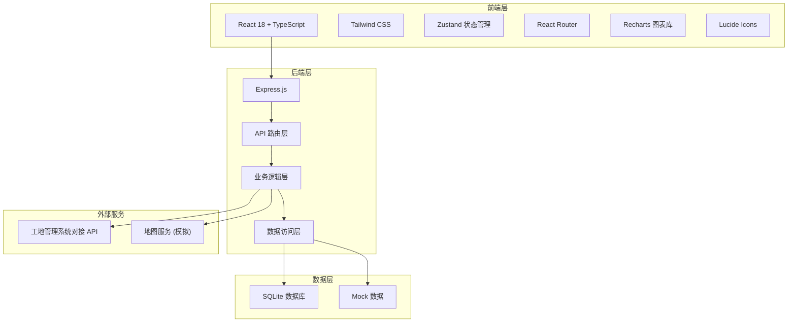
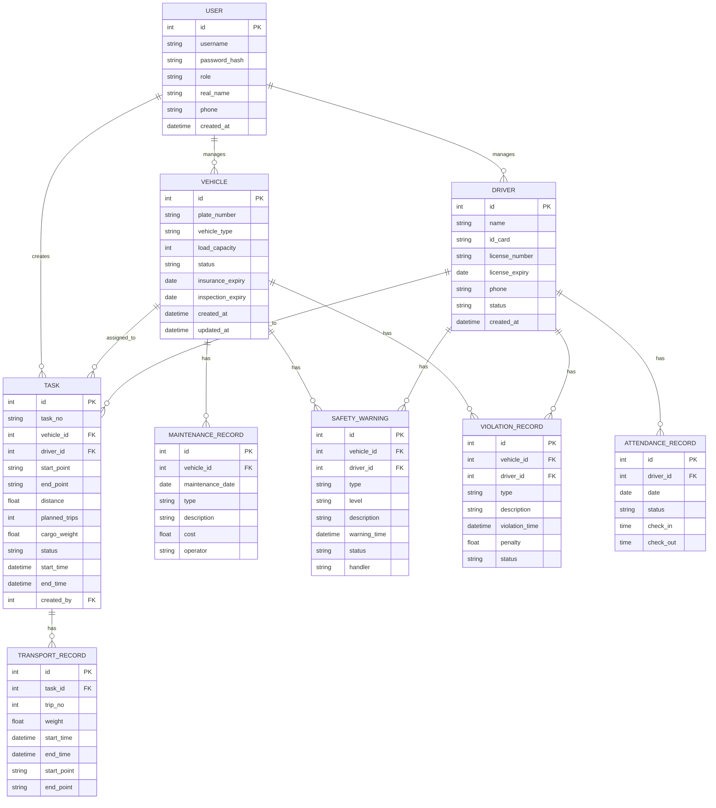

## 1. 架构设计



## 2. 技术选型说明

- **前端框架**：React 18 + TypeScript，提供类型安全和组件化开发
- **构建工具**：Vite，快速的开发服务器和构建性能
- **样式方案**：Tailwind CSS 3，原子化 CSS，快速构建响应式界面
- **状态管理**：Zustand，轻量级状态管理方案
- **路由管理**：React Router v6，声明式路由
- **图表库**：Recharts，基于 React 的数据可视化图表
- **图标库**：Lucide React，轻量级图标组件
- **后端框架**：Express 4 + TypeScript，RESTful API 设计
- **数据库**：SQLite（开发阶段），轻量级嵌入式数据库
- **数据格式**：Mock 数据 + 本地存储，演示用数据

## 3. 目录结构

```
.
├── src/                          # 前端源码
│   ├── components/               # 公共组件
│   │   ├── Layout/              # 布局组件
│   │   ├── Table/               # 表格组件
│   │   ├── Form/                # 表单组件
│   │   ├── Chart/               # 图表组件
│   │   └── common/              # 通用组件
│   ├── pages/                    # 页面组件
│   │   ├── Login/               # 登录页
│   │   ├── Dashboard/           # 首页仪表盘
│   │   ├── Vehicles/            # 车辆管理
│   │   ├── Tasks/               # 任务调度
│   │   ├── Drivers/             # 驾驶员管理
│   │   ├── Statistics/          # 运输统计
│   │   ├── Safety/              # 安全监控
│   │   └── System/              # 系统管理
│   ├── hooks/                    # 自定义 Hooks
│   ├── utils/                    # 工具函数
│   ├── store/                    # Zustand 状态管理
│   ├── types/                    # TypeScript 类型定义
│   ├── mock/                     # Mock 数据
│   ├── App.tsx                  # 根组件
│   ├── main.tsx                 # 入口文件
│   └── index.css                # 全局样式
├── api/                          # 后端源码
│   ├── routes/                   # API 路由
│   ├── controllers/              # 控制器
│   ├── services/                 # 业务逻辑
│   ├── models/                   # 数据模型
│   ├── middleware/               # 中间件
│   ├── utils/                    # 工具函数
│   └── index.ts                 # 入口文件
├── shared/                       # 共享类型
│   └── types.ts
├── .trae/                        # 项目文档
│   └── documents/
├── package.json
├── vite.config.ts
├── tailwind.config.js
├── tsconfig.json
└── README.md
```

## 4. 路由定义

| 路由路径 | 页面名称 | 说明 |
|----------|----------|------|
| /login | 登录页 | 用户认证 |
| /dashboard | 首页仪表盘 | 数据概览和快捷入口 |
| /vehicles | 车辆管理 | 车辆列表、新增、编辑、详情 |
| /vehicles/:id | 车辆详情 | 车辆详细信息、证件、维护记录 |
| /tasks | 任务调度 | 运输任务列表、任务分配 |
| /tasks/:id | 任务详情 | 任务详细信息、实时跟踪 |
| /drivers | 驾驶员管理 | 驾驶员列表、新增、编辑、详情 |
| /drivers/:id | 驾驶员详情 | 驾驶员详细信息、资质、出勤记录 |
| /statistics | 运输统计 | 运输量统计报表、数据可视化 |
| /safety | 安全监控 | 实时监控、预警列表、违规记录 |
| /system/users | 用户管理 | 用户列表、角色权限配置 |
| /system/data | 数据管理 | 数据备份与恢复 |

## 5. API 接口定义

### 5.1 认证接口

| 接口 | 方法 | 说明 |
|------|------|------|
| /api/auth/login | POST | 用户登录 |
| /api/auth/logout | POST | 用户登出 |
| /api/auth/current | GET | 获取当前用户信息 |

### 5.2 车辆管理接口

| 接口 | 方法 | 说明 |
|------|------|------|
| /api/vehicles | GET | 获取车辆列表 |
| /api/vehicles/:id | GET | 获取车辆详情 |
| /api/vehicles | POST | 新增车辆 |
| /api/vehicles/:id | PUT | 更新车辆信息 |
| /api/vehicles/:id | DELETE | 删除车辆 |
| /api/vehicles/:id/maintenance | GET | 获取维护记录 |
| /api/vehicles/:id/maintenance | POST | 添加维护记录 |

### 5.3 任务调度接口

| 接口 | 方法 | 说明 |
|------|------|------|
| /api/tasks | GET | 获取任务列表 |
| /api/tasks/:id | GET | 获取任务详情 |
| /api/tasks | POST | 创建运输任务 |
| /api/tasks/:id | PUT | 更新任务状态 |
| /api/tasks/:id/location | GET | 获取车辆实时位置 |

### 5.4 驾驶员管理接口

| 接口 | 方法 | 说明 |
|------|------|------|
| /api/drivers | GET | 获取驾驶员列表 |
| /api/drivers/:id | GET | 获取驾驶员详情 |
| /api/drivers | POST | 新增驾驶员 |
| /api/drivers/:id | PUT | 更新驾驶员信息 |
| /api/drivers/:id | DELETE | 删除驾驶员 |

### 5.5 运输统计接口

| 接口 | 方法 | 说明 |
|------|------|------|
| /api/statistics/daily | GET | 每日运输量统计 |
| /api/statistics/monthly | GET | 每月运输量统计 |
| /api/statistics/vehicle | GET | 每车运输量统计 |
| /api/statistics/export | GET | 数据导出 |

### 5.6 安全监控接口

| 接口 | 方法 | 说明 |
|------|------|------|
| /api/safety/warnings | GET | 获取安全预警列表 |
| /api/safety/warnings/:id | PUT | 处理预警 |
| /api/safety/violations | GET | 获取违规记录 |
| /api/safety/real-time | GET | 实时监控数据 |

### 5.7 系统管理接口

| 接口 | 方法 | 说明 |
|------|------|------|
| /api/users | GET | 获取用户列表 |
| /api/users | POST | 新增用户 |
| /api/users/:id | PUT | 更新用户信息 |
| /api/users/:id | DELETE | 删除用户 |
| /api/system/backup | POST | 数据备份 |
| /api/system/restore | POST | 数据恢复 |
| /api/system/logs | GET | 操作日志 |

## 6. 数据模型

### 6.1 实体关系图



### 6.2 核心数据说明

- **用户表**：存储系统用户信息，包含用户名、密码哈希、角色等
- **车辆表**：存储车辆基本信息、证件有效期、状态等
- **驾驶员表**：存储驾驶员基本信息、驾驶证信息、状态等
- **任务表**：存储运输任务信息，关联车辆和驾驶员
- **运输记录表**：存储每次运输的详细数据
- **安全预警表**：存储超速、疲劳驾驶等预警信息
- **违规记录表**：存储违规行为记录及处理情况

## 7. 安全设计

### 7.1 认证与授权

- JWT Token 认证机制
- 基于角色的访问控制（RBAC）
- 密码加密存储（bcrypt）
- Token 过期自动刷新

### 7.2 数据安全

- 敏感数据加密存储
- API 接口权限校验
- SQL 注入防护
- XSS 攻击防护
- 操作日志审计

### 7.3 系统安全

- 数据定期备份
- 异常登录检测
- 接口访问频率限制
